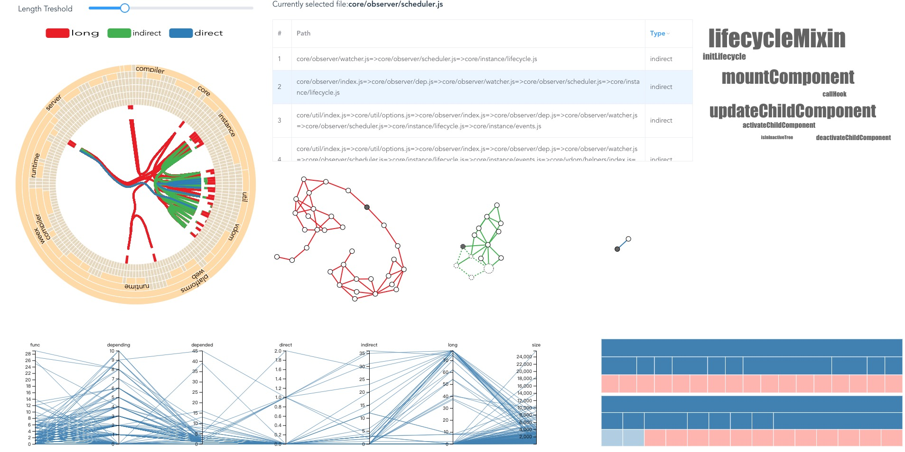

# srcodehelper

> 可视化文件之间的依赖（引用）关系、坏依赖（长依赖|间接依赖|直接依赖）

##  可视化系统界面

## 系统组成
- 依赖关系环图,对应DepHellWrapper.vue:展示文件的层次结构以及三种坏依赖关系的空间分布
- 平行坐标图，对应ParallelCoordinate.vue:展示所有文件的7个维度的属性（函数个数、三种坏依赖的个数、文件大小、依赖和被依赖数）
- 力导引图:展示依赖的拓扑关系
- 词云:通过函数来抽象该文件的作用
- 树图:展示某个文件的被依赖和依赖文件，以及分别依赖和被依赖哪些函数

## 主要技术栈
- vue:用于实现组件化以及数据和视图的双向绑定
- d3:用于绘制各种常见以及复杂的图表
- sass:书写更简洁的css
- axios:发送http请求
- ~~vuex~~:已用vue bus重构替代
